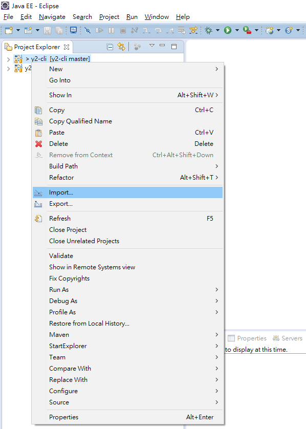
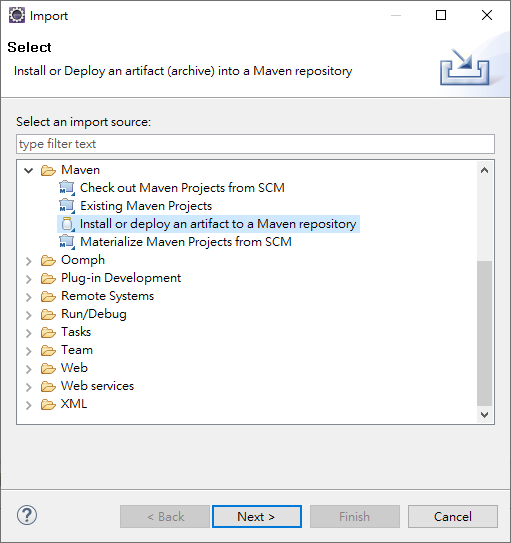
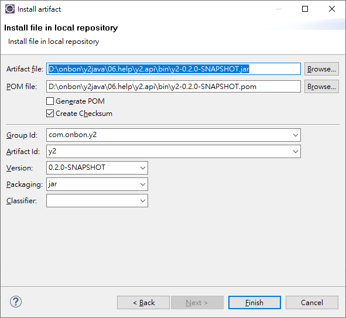

Onbon Y2 Java Library (preview version)
===
* [API Document](https://api2doc.github.io/onbon.y2.api/)
* [中文範例](README_TW.md)
* [中文范例](README_CN.md)

## Introduction

The Onbon Y2 Java library provides an API for operating full-color board of Y2 Series.

Y2 Java library supports Android 5.0+ (API level 21+) and Java 6+.
## Libraries
### Jar Files
* __y2__ - Y2 core API
  * commons-codec
  * uia-utils
* __y2-message__ - Y2 messages
* __y2-Http__ - Y2 http interface
* __y2-http-hc__ - Y2 http implementation
  * httpmime
    * httpclient
      * httpcore
      * commons-logging
      * commons-codec
* __y2-http-ok__ - Y2 http implementation
  * okhttp
    * okio
* __uia-comm__ - TCP/UDP tool
* __uia-utils__ - Common utilities
* __simple-xml__ - XML parser
  * stax-api
  * stax
  * xpp3

### Android only
* j2a - Java wrapper.

## Maven Conifguration
### Local Maven repository
You can use Eclipse IDE to import Y2 jar files into local m2 repository

1. Start `import...` to launch setup dialog.


2. Select `Install or deploy an atrifact to a Maven repository` under Maven.


3. Select an artifact file, information of POM file, Group Id, Artifact Id, Version, Packaging will be filled automatically.


4. Click `Finish` to install selected artifact to the local repository.

The import order of jar files are:
* y2-message
* y2-http
* y2-http-hc
* y2-http-ok
* y2

### POM.xml
After importing Y2 library, you can add the following dependencies and repositories.

```xml
<dependencies>
    <dependency>
        <groupId>com.onbon.y2</groupId>
        <artifactId>y2</artifactId>
        <version>0.2.0-SNAPSHOT</version>
    </dependency>
    <dependency>
    	<groupId>com.onbon.y2</groupId>
    	<artifactId>y2-http-hc</artifactId>
    	<version>0.2.0-SNAPSHOT</version>
    </dependency>
    <dependency>
    	<groupId>com.onbon.y2</groupId>
    	<artifactId>y2-http-ok</artifactId>
    	<version>0.2.0-SNAPSHOT</version>
    </dependency>
</dependencies>
<repositories>
    <repository>
        <snapshots>
            <enabled>false</enabled>
        </snapshots>
        <id>central</id>
        <name>bintray</name>
        <url>http://jcenter.bintray.com</url>
    </repository>
</repositories>
```

## Http Drivers
There are two http drivers: __Apache HttpComponents__ and __OkHttp__. The default driver Y2 API uses is Apache HttpComponents.
* __Apache HttpComponents__

  The driver runs on __Java 6+__. _Not support Andorid_.

* __OkHttp__

  The driver runs on __Java 8__ only and supports __Android__.

## How To Use
1. Initialize API runtime environment. Just once.
    ```java
    // without log4j
    Y2Env.initial();

    // with log4j
    Y2Env.initial(pathToLog4j);

    // android or JDK 8
    Y2Env.initial(true);

    // with log4j and android or JDK 8
    Y2Env.initial(pathToLog4j, true);

    // set default font properties
    Y2Font.defaultFont("SimSun", 20, Y2FontSizeType.PIXEL);
    ```

2. Connect to a specific screen and run some commands.
    ```java
    // 1. new screen instance
    Y2Screen screen = new Y2Screen("http://1.2.3.4");

    // 2. login
    if (!screen.login(user, pwd)) {
        return;
    }

    // 3. do something
    screen.turnOn();
    screen.changeVolume(60);
    ...

    // 4. logout
    screen.logout();
    ```
3. Broadcast a request to the controllers of the same network
    ```java
    // 1. initial a service
    Y2ScreenFactory factory = new Y2ScreenFactory("192.168.1.1");

    // 2. register a listen to handle responses.
    factory.listenSearchControllers(new ResponseHandler<SearchControllerOutput>() {

		@Override
		public void run(String pid, String barcode, SearchControllerOutput output) {
			System.out.println(pid);
			System.out.println(barcode);
			System.out.println(output.getIp());
		}
	});

    // 3. start
    factory.start();

    // 4. execute
    factory.searchControllers();
    ```


## Toturial
### Simple Operations
```java
// 1
Y2Screen screen = new Y2Screen("http://1.2.3.4");

// 2
if (!screen.login("guest", "guest")) {
    return;
}

// 3
screen.syncTime(new Date());
screen.turnOff();
screen.turnOn();
screen.changeVolume(60);
screen.clearPlayResources();

// 4
screen.logout();
```

### Play a marquee
```java
// 1
Y2Screen screen = new Y2Screen("http://1.2.3.4");

// 2
if (!screen.login("guest", "guest")) {
    return;
}

// 3.1 create a marquee area
MarqueeArea area = new MarqueeArea(0, 0, screen.getWidth(), 40);
area.addContent("Hello everyone.")
    .fgColor(Color.green)
    .getFont()
        .size(16)
area.addContent("We are happy to announce that Y2 Java library has released.")
    .fgColor(Color.blue)
    .getFont()
        .size(20);


// 3.2 create a playable program
ProgramPlayFile prog = new ProgramPlayFile(1);
prog.getAreas().add(area);

// 3.3 write a playlist
String listId = screen.writePlaylist(playFile);

// 3.4 play
screen.play(listId);

// 4
screen.logout();
```

## Tutorial - Playlist, Program
### Playlist
The playlist is used to play programs and is composed of more than one program.
#### General
```java
ProgramPlayFile file1 = new ProgramPlayFile(1) // program_1
ProgramPlayFile file2 = new ProgramPlayFile(2) // program_2
String playlist = screen.writePlaylist(file1, file2, ...);

screen.play(playlist);

screen.checkPlayer()    // Check current playing information
```
#### Instant Content
```java
ProgramPlayFile file1 = new ProgramPlayFile(1) // program_1
ProgramPlayFile file2 = new ProgramPlayFile(2) // program_2
String playlist = screen.writePlaylist(file1, file2, ...);

screen.playInstContent(playlist);

screen.checkPlayer()    // Check current playing information
```

### Program
The program is used to plan contents to be displayed on the screen, each content is managed through an area. A program is composed of more than one area, each has its own display position and size.
```java
ProgramPlayFile file1 = new ProgramPlayFile(1) // program_1
file1.getAreas().add(area1);
file1.getAreas().add(area2);
```
#### Play everyday
```java
file1.getPlayWeek().all();           
```

#### Play in count mode, repeat 3 times then switch to the next program.
```java
file1.setPlayMode(PlayMode.COUNTER)  
file1.setPlayCount(3);
```
#### Play in time mode, play 45 seconds then switch to the next program.
```java
file2.setPlayMode(PlayMode.TIMER)  
file2.setPlayTime(45);
```

## Tutorial - Area
The area is used to manage the content, including:
* Marquee
* Text
* Textualize
* DatTime
* Clock
* Counter
* Video
* ChiCalendar
* Animation

All above support border style.

### Border Style
The border is a rectangle around the area. After enabling border style, the size fo the content will be reduced according to the width of the border.
```java
// Enable
AreaBorderStyle style = area.enableBorder(3);
style.animation(52, 8)  // animation:52, speed:8
     .blinkGrade(8);    // blink:8

// Disable
area.disableBorder();   
```

### Marquee Area
The MarqueeArea is a single line text area which moves text horizontally from one side to another.
```java
MarqueeArea area = new MarqueeArea(0, 0, 128, 30);
area.right2Left(true);

// page1
area.addContent("Hello everyone.")
    .fgColor(Color.white)
    .bgColor(Color.black)
    .stuntSpeed(16)
    .getFont()
        .size(24)
        .bold()
        .strikethrough()
        .underline();

// page2
area.addContent("We are happy to announce that Y2 Java library has released.")
    .fgColor(Color.black)
    .bgColor(Color.white)
    .animationSpeed(1)
    .getFont()
        .size(20);

```

### Text Area
The TextArea is text based area which displays content section by section.
```java
TextArea area = new TextArea(0, 0, 128, 64);
area.stuntType(10);

// section1
area.addTextSection("Hello everyone.")
    .fgColor(Color.white)
    .bgColor(Color.black)
    .stayTime(8)
    .animationSpeed(16)
    .horizontalAlignment(AlignmentType.CENTER)
    .verticalAlignment(AlignmentType.CENTER)
    .rowHeight(30)
    .getFont()
        .size(24)
        .bold()
        .strikethrough()
        .underline();

// section2
area.addTextSection("We are happy to announce that Y2 Java library has released.")
    .fgColor(Color.black)
    .bgColor(Color.white)
    .stayTime(9)
    .animationSpeed(1)
    .horizontalAlignment(AlignmentType.NEAR)
    .verticalAlignment(AlignmentType.FAR)
    .rowHeight(20)
    .getFont()
        .size(20);

```
### Textualize Area
Similar to the __Text Area__, the main difference is that the text color is replaced by the material, and the background is transparent.
```java
TextualizeArea area = new TextualizeArea(0, 0, 128, 64);
area.addMaterial("sample/textualize_bg.jpg");

TextualizeAreaTextMask page = area.addTextSection("Welcome to ONBON");
page.animationSpeed(4)
    .horizontalAlignment(AlignmentType.NEAR)
    .verticalAlignment(AlignmentType.NEAR);
    .getFont()
        .size(40)
        .bold();
```
Material


Text Rendered Result


### DateTime Area
The DateTimeArea displays date and time depending on specific patterns. The DateTimeArea will be resized automatically without width and height.
```java
DateTimeArea area;

// fixed location and size
area = new DateTimeArea(100, 40, 200, 60);
// fixed location, auto size
area = new DateTimeArea(100, 40);

area.bgColor(Color.darkGray)
    .horizontalAlignment(AlignmentType.CENTER);

// line1: display date and time, format is AM 8:16 2019-02-15
area.addUnits(DateTimePattern.AMPM_H_MM, DateTimePattern.YYYY_MM_DD1)
    .fgColor(Color.yellow);
    .getFont()
        .bold()
        .underline();

// line2: display week
area.addUnits(DateTimePattern.WEEK);

// line3: display month
area.addUnits(DateTimePattern.MONTH);
    .getFont()
        .bold();
```

## Bulletin Area
The bulletin area displays text based content on the screen immediately.
```java
// get the bulletin manager
Y2BulletinManager bulletin = screen.bulletin();

// bulletin 1
BulletinArea area1 = new BulletinArea(1, "bullet_01", 0, 0, 100, 40);
area1.bgColor(Color.darkGry)
     .fgColor(Color.red)
     .content("News: We are happy to announce to release this API.")

// bulletin 2
BulletinArea area2 = new BulletinArea(2, "bullet_02", 0, 100, 100, 40);
area2.bgColor(Color.darkGry)
     .fgColor(Color.green)
     .content("News: Java Doc is available too.")

// upload to Y2
bulletin.write(area1);
bulletin.write(area2);

// play
bulletin.play();

// delete bulletin 2
bulletin.delete(2);

// stop
bulletin.stop();

```

## Dynamic Area
The dynamic area displays content without any time configuration, and be deleted automatically after rebooting the hardware.
```java
// get the dynamic manager
Y2DynamicManager dyn = screen.dynamic();

// dynamic program
DynamicPlayFile file = new DynamicPlayFile();

// dynamic area
DynamicArea area = file.create(0, 0, 100, 40);
area.addText("Welcome to ONBON");
area.addText("We are happy to announce to release this API")

// upload to Y2
dyn.write(file);
```

## Tutorial - Broadcast Service
Broadcast commands to all controllers of the same network.
1. Choose a network to initial this service.


2. Setup response Handlers just once
    * listenSearchControllers
    * listenUpdateNetworkOption
    * listenRestartNetwork
    * listenConnectWifi
    * listenQueryWifiStatus
    * listenDisconnectWifi
    * listenApProperty


3. Start the service
    * response port


4. Execute some commnads
    * searchControllers
    * updateNetworkOption
    * restartNetwork
    * connectWifi
    * queryWifiStatus
    * disconnectWifi
    * modifyApProperty


5. Stop the service

```java
// 1
String lan = "192.168.1.10";
Y2ScreenFactory factory = new Y2ScreenFactory(lan);
// 2.1
factory.listenSearchController(new ResponseHandler<SearchControllerOutput>() {

	@Override
	public void run(String pid, String barcode, SearchControllerOutput output) {
        // TODO:
	}
});
// 2.2
factory.listenQueryWifiStatus(new ResponseHandler<QueryWifiStatusOutput>() {

	@Override
	public void run(String pid, String barcode, QueryWifiStatusOutput output) {
        // TODO:
	}
});
// 3
factory.start(10003);
// 4.1
factory.searchControllers();
// 4.2
factory.queryWifiStatus();
```
