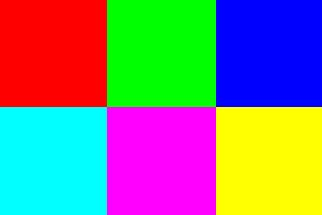

仰邦 Y2 Java 函式库 (预览版)
===
* [API Document](https://api2doc.github.io/onbon.y2.api/)

## 如何使用
1. 初始化 Y2 API 环境。仅需一次。
    ```java
    // without log4j
    Y2Env.initial();

    // with log4j
    Y2Env.initial(pathToLog4j);

    // android
    Y2Env.initial(true);

    // with log4j and JDK 8
    Y2Env.initial(pathToLog4j, true);
    ```

2. 连上特定的屏幕并执行一些命令。
    ```java
    // 1. 建立一个新的屏幕
    Y2Screen screen = new Y2Screen("http://1.2.3.4");

    // 2. 登入
    if (!screen.login(user, pwd)) {
        return;
    }

    // 3. 做些事情
    screen.turnOn();
    screen.changeVolume(60);
    ...

    // 4. 注销
    screen.logout();
    ```

## 范例
### 简单的操作
```java
// 1
Y2Screen screen = new Y2Screen("http://1.2.3.4");

// 2
if (!screen.login("guest", "guest")) {
    return;
}

// 3
screen.syncTime(new Date());
screen.turnOff();
screen.turnOn();
screen.changeVolume(60);
screen.clearPlayResources();

// 4
screen.logout();
```

### 拨放一个跑马灯
```java
// 1
Y2Screen screen = new Y2Screen("http://1.2.3.4");

// 2
if (!screen.login("guest", "guest")) {
    return;
}

// 3.1 建立一个跑马灯分区
MarqueeArea area = new MarqueeArea(0, 0, screen.getWidth(), 40);
area.addContent("Hello everyone.")
    .fgColor(Color.green)
    .getFont()
        .size(16)
area.addContent("We are happy to announce that Y2 Java library has released.")
    .fgColor(Color.blue)
    .getFont()
        .size(20);


// 3.2 建立一个可拨放的节目
ProgramPlayFile prog = new ProgramPlayFile(1);
prog.getAreas().add(area);

// 3.3 写入节目，取得拨放清单编号。
String listId = screen.writePlaylist(playFile);

// 3.4 拨放
screen.play(listId);

// 4
screen.logout();
```

## 范例 - 播放列表与节目
### 播放列表 Playlist
播放列表用于播放节目，由一个以上的节目组合而成。
#### 一般播放
```java
ProgramPlayFile file1 = new ProgramPlayFile(1) // program_1
ProgramPlayFile file2 = new ProgramPlayFile(2) // program_2
String playlist = screen.writePlaylist(file1, file2, ...);

screen.play(playlist);

screen.checkPlayer()    // 检查目前播放状态
```
#### 插播
```java
ProgramPlayFile file1 = new ProgramPlayFile(1) // program_1
ProgramPlayFile file2 = new ProgramPlayFile(2) // program_2
String playlist = screen.writePlaylist(file1, file2, ...);

screen.playInstContent(playlist);

screen.checkPlayer()    // 检查目前播放状态
```

### 节目 Program
节目用来规划屏幕上要显示的内容，内容透过区域进行管理。一个节目由一个以上的区域组合而成，每个区域有各自的显示位置与大小。
```java
ProgramPlayFile file1 = new ProgramPlayFile(1) // program_1
file1.getAreas().add(area1);
file1.getAreas().add(area2);
```
#### 每天播放
```java
file1.getPlayWeek().all();           
```

#### 以计次方式播放，重复 3 次后切换到下一个节目
```java
file1.setPlayMode(PlayMode.COUNTER)  
file1.setPlayCount(3);
```
#### 以计时方式播放，播放 45 秒后切换到下一个节目
```java
file2.setPlayMode(PlayMode.TIMER)  
file2.setPlayTime(45);
```

## 范例 - 区域
区域用来控制显示内容，内容包括：
* 跑马灯 (Marquee)
* 一般图文 (Text)
* 具备屏蔽效果的图文 (Textualize)
* 时间 (DatTime)
* 时钟 (Clock)
* 计数器 (Counter)
* 视频 (Video)
* 农历 (ChiCalendar)
* 动态效果 (Animation)

以上区域皆具备边框功能，默认关闭。

### 边框效果 Border Style
边框为一为围绕在区域周围的矩形，启用后，内容的有效可视范围会依据边框宽度缩小。
```java
// 启用边框
AreaBorderStyle style = area.enableBorder(3);
style.animation(52, 8)  // 特效 52, 速度 8
     .blinkGrade(8);    // 闪烁 8

// 取消边框
area.disableBorder();   
```

### 跑马灯分区 Marquee Area
跑马灯分区是一个单行文字的分区，将内容以水平移动的方式显示在屏幕上。
```java
MarqueeArea area = new MarqueeArea(0, 0, 128, 30);
area.right2Left(true);

// page1
area.addContent("Hello everyone.")
    .fgColor(Color.white)   // 前景色
    .bgColor(Color.black)   // 背景色
    .animationSpeed(16)     // 特效播放速度
    .getFont()
        .size(24)           // 字体大小
        .bold()             // 粗体
        .strikethrough()    // 删除线
        .underline();       // 底线

// page2
area.addContent("We are happy to announce that Y2 Java library has released.")
    .fgColor(Color.black)   // 前景色
    .bgColor(Color.white)   // 背景色
    .animationSpeed(1)      // 特效播放速度
    .getFont()
        .size(20);          // 字体大小

```

### 一般图文分区 Text Area
文字分区是一个以文字内容文主的分区，以节的方式添加，节与节之间会自动分页。
```java
TextArea area = new TextArea(0, 0, 128, 64);
area.stuntType(10);         // 特效

// section1
area.addTextSection("Hello everyone.")
    .fgColor(Color.white)   // 前景色
    .bgColor(Color.black)   // 背景色
    .stayTime(8)            // 单页停留时间
    .animationSpeed(16)     // 特效播放速度
    .horizontalAlignment(AlignmentType.CENTER)  // 水平对齐，置中
    .verticalAlignment(AlignmentType.CENTER)    // 垂直对齐，置中
    .rowHeight(30)          // 行高
    .getFont()
        .size(24)
        .bold()             
        .strikethrough()
        .underline();

// section2
area.addTextSection("We are happy to announce that Y2 Java library has released.")
    .fgColor(Color.black)   // 前景色
    .bgColor(Color.white)   // 背景色
    .stayTime(9)            // 单页停留时间
    .animationSpeed(1)      // 特效播放速度
    .horizontalAlignment(AlignmentType.NEAR)    // 水平对齐，靠左
    .verticalAlignment(AlignmentType.FAR)       // 水平对齐，靠下
    .rowHeight(20)          // 行高
    .getFont()
        .size(20);

```

### 具备屏蔽效果的图文 Textualize Area
与一般图文类似，主要差异为文字颜色用素材取代，背景为透明。
```java
TextualizeArea area = new TextualizeArea(0, 0, 128, 64);
area.addMaterial("sample/textualize_bg.jpg");

TextualizeAreaTextMask page = area.addTextSection("Welcome to ONBON");
page.animationSpeed(4)
    .horizontalAlignment(AlignmentType.NEAR)
    .verticalAlignment(AlignmentType.NEAR);
    .getFont()
        .size(40)
        .bold();
```
素材



文字渲染结果


### 日期时间分区 DateTime Area
日期时间分区将选择的日期、时间、星期样式组合并显示在屏幕上。若没有设定宽与高，日期时间分区会根据内容自动调分区大小显示完整的内容。
```java
DateTimeArea area;

// 固定位置与大小
area = new DateTimeArea(100, 40, 200, 60);
// 固定位置，大小自动调整
area = new DateTimeArea(100, 40);

area.bgColor(Color.darkGray)
    .horizontalAlignment(AlignmentType.CENTER);

// 第一行：显示时间与日期，格式为 AM 8:16 2019-02-15
area.addUnits(DateTimePattern.AMPM_H_MM, DateTimePattern.YYYY_MM_DD1)
    .fgColor(Color.yellow);
    .getFont()
        .bold()
        .underline();

// 第二行：显示星期
area.addUnits(DateTimePattern.WEEK);

// 第三行：显示月份
area.addUnits(DateTimePattern.MONTH);
    .getFont()
        .bold();
```

## 范例 - 公告分区 Bulletin Area
公告分区用于即刻显示一些重要的文字讯息。
```java
// 取得管理程序
Y2BulletinManager bulletin = screen.bulletin();

// 建立公告一
BulletinArea area1 = new BulletinArea(1, "公告一", 0, 0, 200, 40);
area1.bgColor(Color.darkGry)
     .fgColor(Color.red)
     .content("News: We are happy to announce to release this API.")

// 建立公告二
BulletinArea area2 = new BulletinArea(2, "公告二", 0, 80, 200, 40);
area2.bgColor(Color.darkGry)
     .fgColor(Color.green)
     .content("News: Java Doc is available too.")

// 将公告一、公告二上传
bulletin.write(area1);
bulletin.write(area2);

// 播放
bulletin.play();

// 删除公告二
bulletin.delete(2);

// 停播
bulletin.stop();

```

## 范例 - 动态分区 Dynamic Area
动态分区可于即刻显示讯息，无须时间设置，所有讯息于重开机之后自动被删除。
```java
// 取得管理程序
Y2DynamicManager dyn = screen.dynamic();

// 建立动态节目
DynamicPlayFile file = new DynamicPlayFile();

// 于节目中新增一个动态区
DynamicArea area = file.create(0, 0, 100, 40);
area.addText("Welcome to ONBON");
area.addText("We are happy to announce to release this API")

// 将动态节目上传
dyn.write(file);
```
