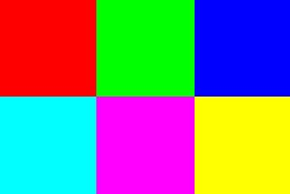

仰邦 Y2 Java 函式庫 (預覽版)
===
* [API Document](https://api2doc.github.io/onbon.y2.api/)

## 如何使用
1. 初始化 Y2 API 環境。僅需一次。
    ```java
    // without log4j
    Y2Env.initial();

    // with log4j
    Y2Env.initial(pathToLog4j);

    // android
    Y2Env.initial(true);

    // with log4j and JDK 8
    Y2Env.initial(pathToLog4j, true);
    ```

2. 連上特定的屏幕並執行一些命令。
    ```java
    // 1. 建立一個新的屏幕
    Y2Screen screen = new Y2Screen("http://1.2.3.4");

    // 2. 登入
    if (!screen.login(user, pwd)) {
        return;
    }

    // 3. 做些事情
    screen.turnOn();
    screen.changeVolume(60);
    ...

    // 4. 登出
    screen.logout();
    ```

## 範例
### 簡單的操作
```java
// 1
Y2Screen screen = new Y2Screen("http://1.2.3.4");

// 2
if (!screen.login("guest", "guest")) {
    return;
}

// 3
screen.syncTime(new Date());
screen.turnOff();
screen.turnOn();
screen.changeVolume(60);
screen.clearPlayResources();

// 4
screen.logout();
```

### 撥放一個跑馬燈
```java
// 1
Y2Screen screen = new Y2Screen("http://1.2.3.4");

// 2
if (!screen.login("guest", "guest")) {
    return;
}

// 3.1 建立一個跑馬燈分區
MarqueeArea area = new MarqueeArea(0, 0, screen.getWidth(), 40);
area.addContent("Hello everyone.")
    .fgColor(Color.green)
    .getFont()
        .size(16)
area.addContent("We are happy to announce that Y2 Java library has released.")
    .fgColor(Color.blue)
    .getFont()
        .size(20);


// 3.2 建立一個可撥放的節目
ProgramPlayFile prog = new ProgramPlayFile(1);
prog.getAreas().add(area);

// 3.3 寫入節目，取得撥放清單編號。
String listId = screen.writePlaylist(playFile);

// 3.4 撥放
screen.play(listId);

// 4
screen.logout();
```

## 範例 - 播放清單與節目
### 播放清單 Playlist
播放清單用於播放節目，由一個以上的節目組合而成。
#### 一般播放
```java
ProgramPlayFile file1 = new ProgramPlayFile(1) // program_1
ProgramPlayFile file2 = new ProgramPlayFile(2) // program_2
String playlist = screen.writePlaylist(file1, file2, ...);

screen.play(playlist);

screen.checkPlayer()    // 檢查目前播放狀態
```
#### 插播
```java
ProgramPlayFile file1 = new ProgramPlayFile(1) // program_1
ProgramPlayFile file2 = new ProgramPlayFile(2) // program_2
String playlist = screen.writePlaylist(file1, file2, ...);

screen.playInstContent(playlist);

screen.checkPlayer()    // 檢查目前播放狀態
```

### 節目 Program
節目用來規劃屏幕上要顯示的內容，內容透過區域進行管理。一個節目由一個以上的區域組合而成，每個區域有各自的顯示位置與大小。
```java
ProgramPlayFile file1 = new ProgramPlayFile(1) // program_1
file1.getAreas().add(area1);
file1.getAreas().add(area2);
```
#### 每天播放
```java
file1.getPlayWeek().all();           
```

#### 以計次方式播放，重複 3 次後切換到下一個節目
```java
file1.setPlayMode(PlayMode.COUNTER)  
file1.setPlayCount(3);
```
#### 以計時方式播放，播放 45 秒後切換到下一個節目
```java
file2.setPlayMode(PlayMode.TIMER)  
file2.setPlayTime(45);
```

## 範例 - 區域
區域用來控制顯示內容，內容包括：
* 跑馬燈 (Marquee)
* 一般圖文 (Text)
* 具備遮罩效果的圖文 (Textualize)
* 時間 (DatTime)
* 時鐘 (Clock)
* 計數器 (Counter)
* 視頻 (Video)
* 農曆 (ChiCalendar)
* 動態效果 (Animation)

以上區域皆具備邊框功能，預設關閉。

### 邊框效果 Border Style
邊框為一為圍繞在區域周圍的矩形，啟用後，內容的有效可視範圍會依據邊框寬度縮小。
```java
// 啟用邊框
AreaBorderStyle style = area.enableBorder(3);
style.animation(52, 8)  // 特效 52, 速度 8
     .blinkGrade(8);    // 閃爍 8

// 取消邊框
area.disableBorder();   
```

### 跑馬燈分區 Marquee Area
跑馬燈分區是一個單行文字的分區，將內容以水平移動的方式顯示在屏幕上。
```java
MarqueeArea area = new MarqueeArea(0, 0, 128, 30);
area.right2Left(true);

// page1
area.addContent("Hello everyone.")
    .fgColor(Color.white)   // 前景色
    .bgColor(Color.black)   // 背景色
    .animationSpeed(16)     // 特效播放速度
    .getFont()
        .size(24)           // 字體大小
        .bold()             // 粗體
        .strikethrough()    // 刪除線
        .underline();       // 底線

// page2
area.addContent("We are happy to announce that Y2 Java library has released.")
    .fgColor(Color.black)   // 前景色
    .bgColor(Color.white)   // 背景色
    .animationSpeed(1)      // 特效播放速度
    .getFont()
        .size(20);          // 字體大小

```

### 一般圖文分區 Text Area
文字分區是一個以文字內容文主的分區，以節的方式添加，節與節之間會自動分頁。
```java
TextArea area = new TextArea(0, 0, 128, 64);
area.stuntType(10);         // 特效

// section1
area.addTextSection("Hello everyone.")
    .fgColor(Color.white)   // 前景色
    .bgColor(Color.black)   // 背景色
    .stayTime(8)            // 單頁停留時間
    .animationSpeed(16)     // 特效播放速度
    .horizontalAlignment(AlignmentType.CENTER)  // 水平對齊，置中
    .verticalAlignment(AlignmentType.CENTER)    // 垂直對齊，置中
    .rowHeight(30)          // 行高
    .getFont()
        .size(24)
        .bold()             
        .strikethrough()
        .underline();

// section2
area.addTextSection("We are happy to announce that Y2 Java library has released.")
    .fgColor(Color.black)   // 前景色
    .bgColor(Color.white)   // 背景色
    .stayTime(9)            // 單頁停留時間
    .animationSpeed(1)      // 特效播放速度
    .horizontalAlignment(AlignmentType.NEAR)    // 水平對齊，靠左
    .verticalAlignment(AlignmentType.FAR)       // 水平對齊，靠下
    .rowHeight(20)          // 行高
    .getFont()
        .size(20);

```

### 具備遮罩效果的圖文 Textualize Area
與一般圖文類似，主要差異為文字顏色用素材取代，背景為透明。
```java
TextualizeArea area = new TextualizeArea(0, 0, 128, 64);
area.addMaterial("sample/textualize_bg.jpg");

TextualizeAreaTextMask page = area.addTextSection("Welcome to ONBON");
page.animationSpeed(4)
    .horizontalAlignment(AlignmentType.NEAR)
    .verticalAlignment(AlignmentType.NEAR);
    .getFont()
        .size(40)
        .bold();
```
素材



文字渲染結果


### 日期時間分區 DateTime Area
日期時間分區將選擇的日期、時間、星期樣式組合並顯示在屏幕上。若沒有設定寬與高，日期時間分區會根據內容自動調分區大小顯示完整的內容。
```java
DateTimeArea area;

// 固定位置與大小
area = new DateTimeArea(100, 40, 200, 60);
// 固定位置，大小自動調整
area = new DateTimeArea(100, 40);

area.bgColor(Color.darkGray)
    .horizontalAlignment(AlignmentType.CENTER);

// 第一行：顯示時間與日期，格式為 AM 8:16 2019-02-15
area.addUnits(DateTimePattern.AMPM_H_MM, DateTimePattern.YYYY_MM_DD1)
    .fgColor(Color.yellow);
    .getFont()
        .bold()
        .underline();

// 第二行：顯示星期
area.addUnits(DateTimePattern.WEEK);

// 第三行：顯示月份
area.addUnits(DateTimePattern.MONTH);
    .getFont()
        .bold();
```

## 範例 - 公告分區 Bulletin Area
公告分區用於即刻顯示一些重要的文字訊息。
```java
// 取得管理程式
Y2BulletinManager bulletin = screen.bulletin();

// 建立公告一
BulletinArea area1 = new BulletinArea(1, "公告一", 0, 0, 200, 40);
area1.bgColor(Color.darkGry)
     .fgColor(Color.red)
     .content("News: We are happy to announce to release this API.")

// 建立公告二
BulletinArea area2 = new BulletinArea(2, "公告二", 0, 80, 200, 40);
area2.bgColor(Color.darkGry)
     .fgColor(Color.green)
     .content("News: Java Doc is available too.")

// 將公告一、公告二上傳
bulletin.write(area1);
bulletin.write(area2);

// 播放
bulletin.play();

// 刪除公告二
bulletin.delete(2);

// 停播
bulletin.stop();

```

## 範例 - 動態分區 Dynamic Area
動態分區可於即刻顯示訊息，無須時間設置，所有訊息於重開機之後自動被刪除。
```java
// 取得管理程式
Y2DynamicManager dyn = screen.dynamic();

// 建立動態節目
DynamicPlayFile file = new DynamicPlayFile();

// 於節目中新增一個動態區
DynamicArea area = file.create(0, 0, 100, 40);
area.addText("Welcome to ONBON");
area.addText("We are happy to announce to release this API")

// 將動態節目上傳
dyn.write(file);
```
